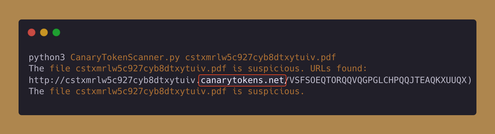

# Acrobat Reader PDF Document
Acrobat Reader PDF Document token will trigger when the PDF is opened using Adobe Acrobat Reader.

## Applicable Environments
The trigger's applicability will be confined to environments specifically where PDF documents are opened using Adobe Acrobat Reader.

## How The Token Gets Triggered?
TBD

## How to Identify the Token Without Triggering It?
Keep the [`indicators.md`](../indicators.md) file handy, as it contains the indicators of how the file is a canary token. <!-- Do not delete this line -->

There are multiple ways to know if the PDF file is a canary token or not - 
1. Open the PDF in any other software other than Adobe Acrobat Reader.
2. Use [CanaryTokenScanner.py](../assets/CanaryTokenScanner.py) which will read the PDF stream and get the URLs that are embeded in the PDF to be triggered when opening in an Adobe Acrobat Reader.  Observe that PDF file contains the canarytokens.net domain, that was supposed to use for callback.

## Contributors

