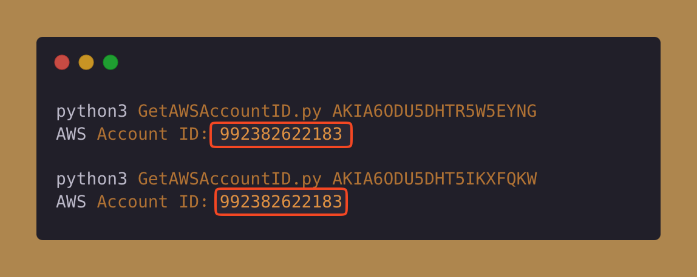

# AWS Keys
AWS Keys will be triggered whenever an API call is made using the access keys.

## Applicable Environments
Applies universally across all environments where API calls can be executed.

## How The Token Gets Triggered?
When AWS keys are used, each usage generates a corresponding log event that is sent to AWS. These log events play a crucial role in detecting the utilization of AWS Keys, serving as a monitoring mechanism to safeguard against unauthorized access or potential security breaches within AWS environments. Using this mechanism/feature canary tokens work and report if someone has used the AWS Keys.

## How to Identify the Token Without Triggering It?
Keep the [`indicators.md`](../indicators.md) file handy, as it contains the indicators of how the file is a canary token. <!-- Do not delete this line -->

To identify whether an AWS key is a canary token, follow these steps:
1. Obtain the Access Key ID and utilize the [GetAWSAccountID.py](../assets/scripts/GetAWSAccountID.py) script to retrieve the AWS Account ID. . 
2. Compare the retrieved AWS Account ID with the specified canary token identifier, `992382622183`. If the Account ID matches this value, it indicates that the AWS key is indeed a canary token.

## References/Comments/Remarks
- [Research - Get the AWS Account ID from Access Key](https://medium.com/@TalBeerySec/a-short-note-on-aws-key-id-f88cc4317489)

## Contributors
