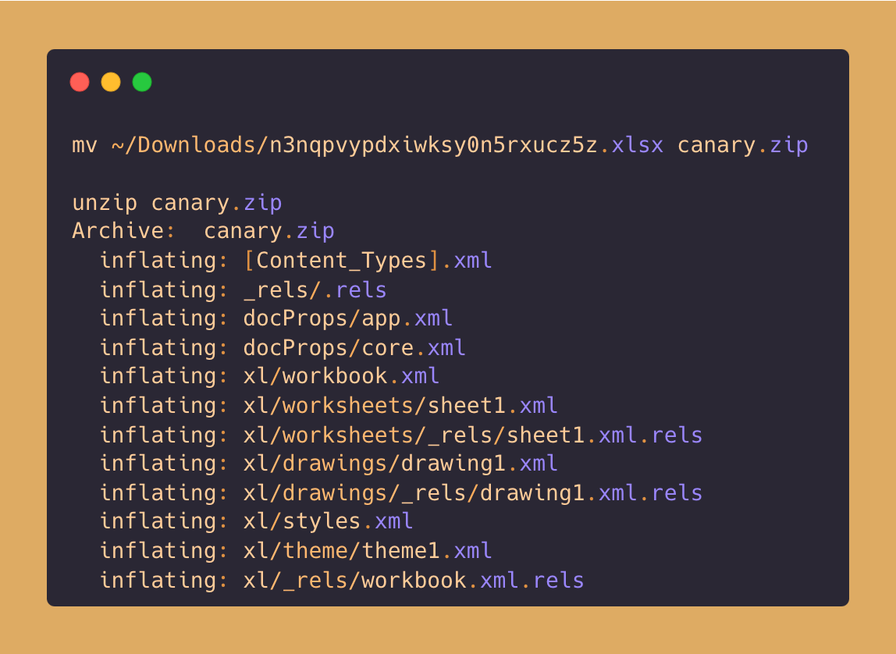
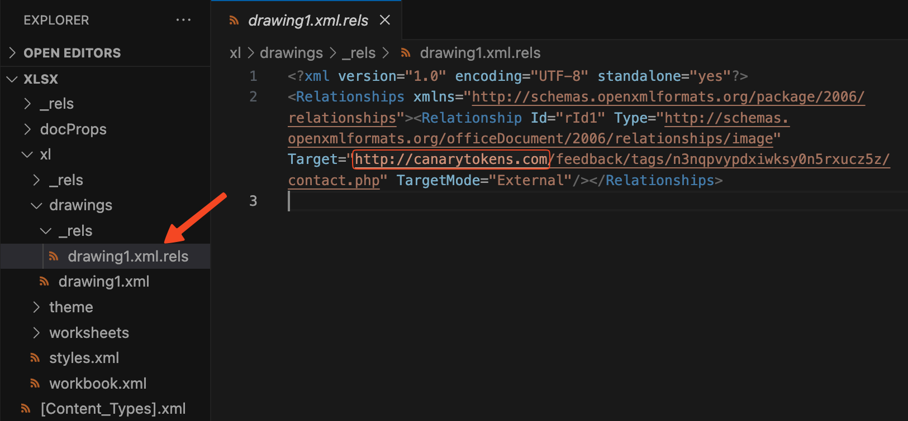

# Microsoft Excel Document
Microsoft Excel Document canary token is a `xlsx` file which is triggered when the file is open using Microsoft Excel.

## Applicable Environments
If the file is open using the Microsoft Excel in any Operating System.

## How The Token Gets Triggered?
Open the `xlsx` file in Microsoft Excel application. It will resolve the canarytoken.com URL embeded in the document & send a callback to the defined URL.

## How to Identify the Token Without Triggering It?
Keep the [`indicators.md`](../indicators.md) file handy, as it contains the indicators of how the file is a canary token. <!-- Do not delete this line -->

To identify the `xlsx` file is a canary token, follow these steps:
1. Rename the `xlsx` file to a `zip` file.
2. Unzip the file, to get the XML files that makes the `xlsx` file.

3. Open the XML code and look for one the domains mentioned in the [`indicators.md`](../indicators.md)

## Contributors
