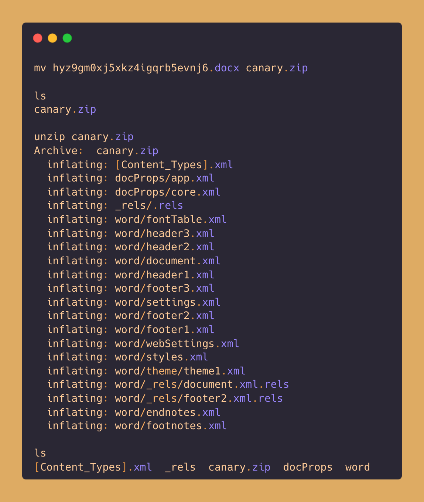
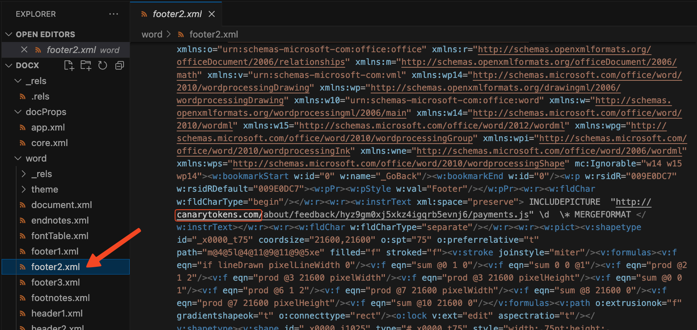
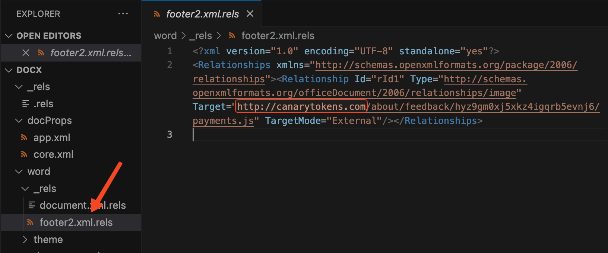

# Microsoft Word Document
Microsoft Word Document canary token is a `docx` file which is triggered when the file is open using Microsoft Word.

## Applicable Environments
If the file is open using the Microsoft Word in any Operating System.

## How The Token Gets Triggered?
Open the `docx` file in Microsoft Word application. It will resolve the canarytoken.org URL embeded in the document & send a callback to the defined URL.

## How to Identify the Token Without Triggering It?
Keep the [`indicators.md`](../indicators.md) file handy, as it contains the indicators of how the file is a canary token. <!-- Do not delete this line -->

To identify the `docx` file is a canary token, follow these steps:
1. Rename the `docx` file to a `zip` file.
2. Unzip the file, to get the XML files that makes the `docx` file.

3. Open the XML code and look for one the domains mentioned in the [`indicators.md`](../indicators.md)

## Contributors
