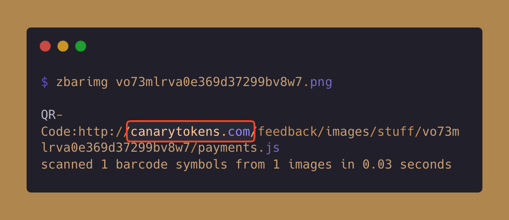

# QR Code
QR Code Canary Token is a QR Code that will trigger when the QR Code is scanned to get the content.

## Applicable Environments
Any device with a QR Code Scanner.

## How The Token Gets Triggered?
The canary token get triggered when the code is scanned using a QR Code scanner, then it tries to hit a URL, which send a callback.

## How to Identify the Token Without Triggering It?
Keep the [`indicators.md`](../indicators.md) file handy, as it contains the indicators of how the file is a canary token. <!-- Do not delete this line -->

To identify whether an QR Code is a canary token, follow these steps:
1. Install the [`zbar`](https://linuxtv.org/downloads/zbar/) utility. I use brew to install the utility - `brew install zbar` 
2. Analyze the QR Code and retrive the data without triggering it -

## Contributors
