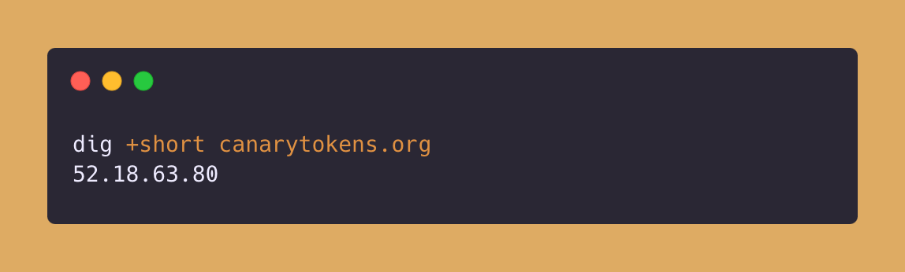

# Wireguard VPN 
Wireguard VPN token generates fake WireGuard VPN configurations intended for installation on phones or servers, which will send alerts when utilized.

## Applicable Environments
Wherever the VPN configuration can be installed and has a Wireguard base.

## How The Token Gets Triggered?
The token gets triggered when you install the VPN profile in mobile or servers. 

## How to Identify the Token Without Triggering It?
Keep the [`indicators.md`](../indicators.md) file handy, as it contains the indicators of how the file is a canary token. <!-- Do not delete this line -->

The token from the canarytokens looks something like this - 
```yaml
[Interface]
  PrivateKey = 0Fqn4CRbvLihOghLkheucoYb+UYfv9aTEsjZjqR0wpI=
  Address = 192.168.123.107/32

[Peer]
  PublicKey = TNSIi9MkaS0KO0/GzhxyFzdgX2qL7PfP43arIdnh1yc=
  AllowedIPs = 192.168.1.0/24
  Endpoint = 52.18.63.80:51820
  PersistentKeepalive = 240
```
If we observe the Endpoint IP, it resolves to an address associated with `canarytokens.org`.


## Contributors
[](https://github.com/0xcardinal)